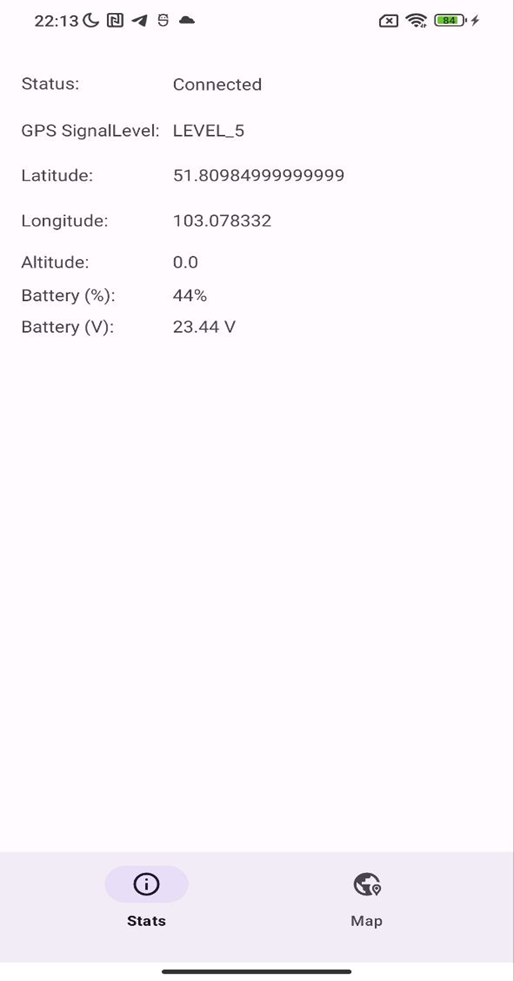
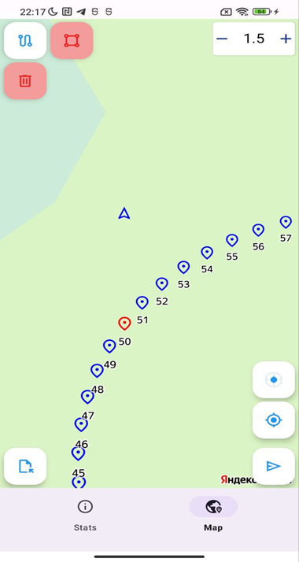

# Демонстрационное мобильное приложение на базе DJI Mobile SDK для формирования маршрута облёта по точкам

Мобильное приложение для проектирования маршрутов для БПЛА DJI и вывода текущей геолокации GPS. Приложение позволяет проектировать маршруты БПЛА при помощи Yandex Mapkit SDK, простраивать кратчайший маршрут при помощи алгоритма А* и загружать данный маршрут на БПЛА.

# Демонстрация 

  
  

